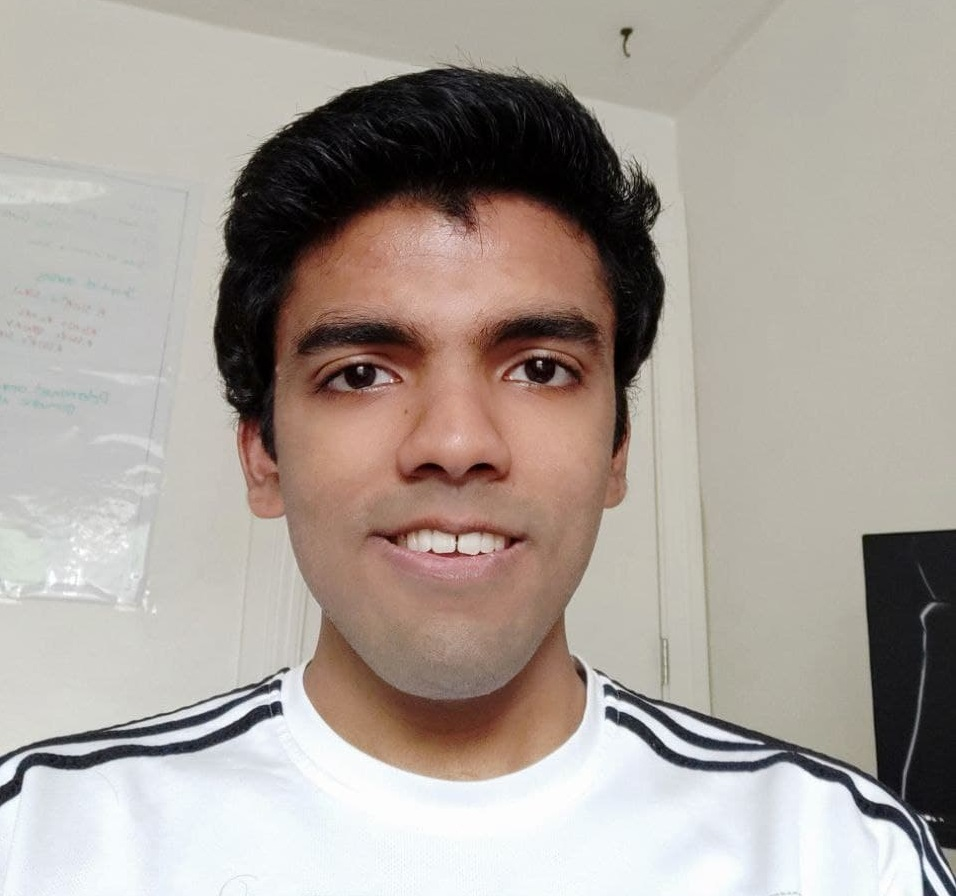

---
# You don't need to edit this file, it's empty on purpose.
# Edit theme's home layout instead if you wanna make some changes
# See: https://jekyllrb.com/docs/themes/#overriding-theme-defaults
layout: default
---
{:style="float: right;margin-right: 7px;margin-top: 7px;height: 200px;border: 5"}

I am a fifth year PhD candidate at UC Berkeley working in the [**High Performance Robotics Lab**](https://hiperlab.berkeley.edu/) advised by Prof. [**Mark W. Mueller**](https://me.berkeley.edu/people/mark-w-mueller/).
My research theme is extending flight time of multirotors via novel concepts and design.
My projects involve a combination of mechanical/electrical design, state estimation, disturbance rejection and sensor fusion.

I am a recipient of the **Chang-Lin Tien Graduate Fellowship** (Spring 2022), and the **Graduate Division Block Grant Award** (Summer 2022, Summer 2020, Summer 2019).

I previously interned at [Zipline](https://www.flyzipline.com/) during Summer 2021, where I worked on sensor characterization and analyzing thrust-torque margins for delivery drones.

I did my undergrad at [IIT Bombay](http://www.iitb.ac.in/) where I majored in [Mechanical Engineering](http://www.me.iitb.ac.in/) with a minor in [Systems and Control Engineering](http://www.sc.iitb.ac.in/). I graduated in May 2018.
